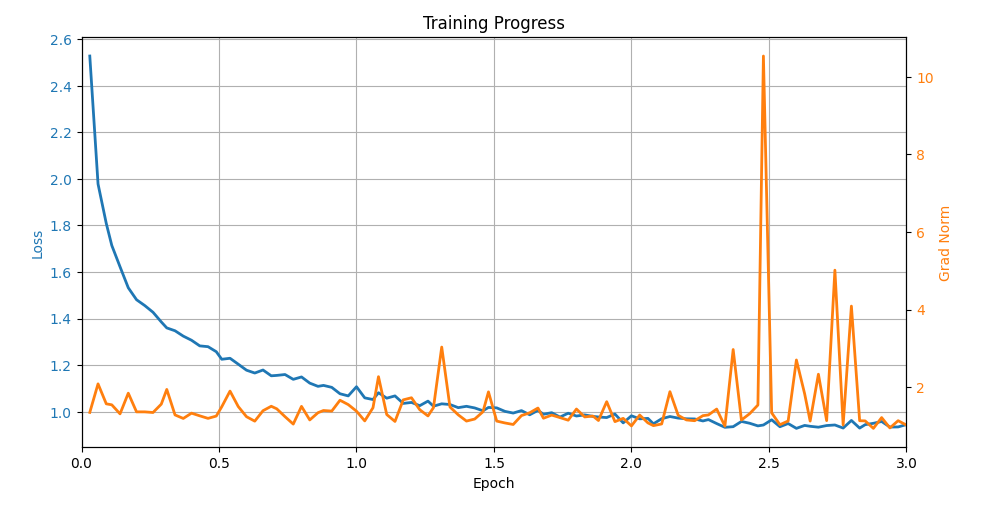

# BioLaySumm: Radiology Report to Layperson Summary
by Roger Zhu

48025845

## Description
This project implements a sequence-to-sequence model to translate expert radiology reports into layperson-friendly summaries. I fine-tuned T5-small using the BioLaySumm dataset from Subtask 2.1 of the ACL 2025 BioLaySumm workshop. The model is trained to generate clear, concise summaries while preserving the medical meaning. An example of a radiology report may be:

> Comparison with the previous study from 02 09 2010 shows growth in the left pulmonary hilum, currently demonstrating a nodular area of approximately 2 cm, not identified in the prior control. This finding prompted the patient to undergo a thoracic CT scan.

which can be summarised as:
>Looking at the images from 2010 and comparing them to now, there's a new growth in the left lung area that's about 2 cm big and wasn't there before. Because of this, the patient had to get a special chest CT scan.

## How it Works
My approach leverages a pretrained T5-small encoder-decoder model. The T5 (Text-to-Text Transfer Transformer) model is a transformer-based encoder-decoder architecture, framing all NLP tasks as a text-to-text problem. It's flexible enough to be fine-tuned to perform translation, summarisation, and question answering. It was developed by Google Research,  *"Exploring the Limits of Transfer Learning with a Unified Text-toText Transformer"* (Raffel et al., 2020).

The T5-small was fine-tuned on paired radiology and lay summaries. Input radiology reports were tokenised and prepended with a summarisation prompt. The model is trained using cross-entropy loss, with attention to padding and truncation to handle variable-length sequences. During inference, beam search was used to generate human-readable summaries. Evaluation is performed on a held-out test set using ROUGE metrics (rouge1, rouge2, rougeL, rougeLsum).

### Preprocessing
- Missing values removed  
- Extremely long reports (>1000 chars) and summaries (>512 chars) filtered to avoid GPU OOM  
- Image references (e.g., `.png`) removed  
- Identical report-summary pairs removed  
- Dataset split: 70% train, 15% validation, 15% test  

The original dataset contained 150,454 training, 10,000 validation, and 10,537 test rows, totaling 170,991 rows. After preprocessing and removing problematic rows, 19,408 rows were filtered out, leaving 151,583 high-quality ones.

After re-splitting into a 70/15/15 partition, the resulting dataset contains 106,103 training, 22,742 validation, and 22,738 test rows.

## Training Setup
- **Model:** T5-small  
- **Parameter-efficient fine-tuning:** PEFT
- **Hardware:** NVIDIA RTX 3090 (24 GB dedicated VRAM), Intel Xeon W-2235 CPU  
- **Training parameters:**  
  - Batch size: 8 (train), 2 (eval)  
  - Gradient accumulation: 2  
  - Learning rate: 5e-5  
  - Epochs: 3  
  - Mixed precision: FP16 enabled  
- **Runtime:** 1hr 5min 19sec
- **Final training loss:** 1.0988 

## Dependencies
- Python 3.13  
- torch 2.9.0+cu130  
- transformers 4.57.1  
- datasets 4.2.0  
- scikit-learn (data splitting)  

## Example Inputs and Outputs

### Example 1
**Radiology report:**  
> Comparison with the previous study from 02 09 2010 shows growth in the left pulmonary hilum, currently demonstrating a nodular area of approximately 2 cm, not identified in the prior control. This finding prompted the patient to undergo a thoracic CT scan.  

**Model summary:**  
> Compared to the previous study from February 9, 2010, there's a growth in the left lung hilum, which is now showing a small round area of about 2 cm, which wasn't there before. This finding prompted the patient to have a chest CT scan.  

**Ground-truth summary:**  
> Looking at the images from 2010 and comparing them to now, there's a new growth in the left lung area that's about 2 cm big and wasn't there before. Because of this, the patient had to get a special chest CT scan.

### Example 2
**Radiology report:**  
> Findings: Follow-up for COVID-19. Technique: Findings unchanged compared to the X-ray from [date]. Bilateral reticular pattern. Subtle bibasal opacities.  

**Model summary:**  
> The results show a follow-up for COVID-19. Technique: The results are the same as the X-ray from [date]. There is a pattern that looks like a net on both sides of the lungs. There are faint hazy areas at the bottom of both lungs.  

**Ground-truth summary:**  
> This report is a follow-up for a COVID-19 patient. The technique used is the same as the previous X-ray taken on [date]. The lungs show a pattern like a net and some faint cloudiness at the bottom of both lungs.

### Example 3
**Radiology report:**  
> No significant radiological alterations.  

**Model summary:**  
> There are no significant changes seen in the x-ray images.  

**Ground-truth summary:**  
> There are no significant changes seen in the radiology images.

| Example | Model       | ROUGE-1 | ROUGE-2 | ROUGE-L | ROUGE-Lsum |
|---------|------------|---------|---------|---------|------------|
| 1       | ChatGPT    | 0.810   | 0.610   | 0.738   | 0.738      |
| 1       | T5-small   | 0.6813  | 0.3146  | 0.5934  | 0.5934     |
| 2       | ChatGPT    | 0.833   | 0.488   | 0.667   | 0.667      |
| 2       | T5-small   | 0.7111  | 0.4318  | 0.5778  | 0.5778     |
| 3       | ChatGPT    | 0.316   | 0.000   | 0.211   | 0.211      |
| 3       | T5-small   | 0.8571  | 0.7368  | 0.8571  | 0.8571     |

From this tiny 3-strong sample, ChatGPT seems to produce more natural and fluent summaries. It captures the meaning and phrasing of moderately complex reports better than T5-small, as reflected in higher ROUGE scores for Examples 1 and 2. However, T5-small excels at short, literal reports, reproducing them with near-perfect overlap, as seen in Example 3. Overall, ChatGPT favors readability and semantic fidelity, while T5-small prioritises exact adherence to the training data.

## Evaluation
Average held-out test set ROUGE scores on the 22,738 testing rows:  
- ROUGE-1 (0.6539) – measures overlap of unigrams (single words) between the model-generated and reference summaries. A score of 0.65 indicates that about two-thirds of the important words in the human summary are correctly captured by the model.

- ROUGE-2 (0.4589) – measures overlap of bigrams (two-word sequences), reflecting the model’s ability to preserve short phrases and local word order. A score of ~0.46 suggests the model retains almost half of the key phrases.

- ROUGE-L (0.5953) – based on the longest common subsequence, capturing sentence-level structure and fluency. A score of ~0.60 indicates that the generated summaries are reasonably close in structure to human-written ones.

- ROUGE-Lsum (0.5953) – similar to ROUGE-L but computed over the entire summary, emphasising overall content coverage.

On paper, the model captures the main content of radiology reports. High ROUGE-1 and ROUGE-L scores show both word-level and structural fidelity, while the moderate ROUGE-2 indicates room for improvement in precise phrasing.

As a human, by reading the actual summaries, we can see that the model captures the key clinical information accurately—it identifies new findings, tracks changes over time, and describes imaging patterns—while rephrasing them in simpler language. Minor differences in phrasing or specificity (e.g., “special chest CT scan” vs. “thoracic CT scan”) show that the model occasionally trades exact terminology for readability, but the essential meaning and clinical implications are surprisingly suitable.

## Usage
1. Prepare cleaned datasets (train/val/test splits in parquet format)  
2. Load model and tokenizer:
```python
from modules import load_model
model, tokenizer = load_model(model_name="t5-small-local", use_lora=False)
```
3. Tokenise datasets using `get_tokenised_datasets(tokenizer)`.
4. Fine-tune using `Trainer` from Hugging Face Transformers.
5. Evaluate with `predict.py` or `my_evaluate.py` scripts.

## Figure


## Reproducibility
- Random seed fixed for train/val/test splits.
- Dataset preprocessing steps are documented above.
- GPU and batch configuration provided for replication.


